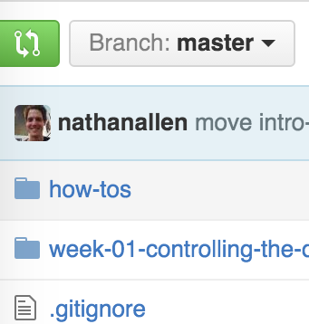
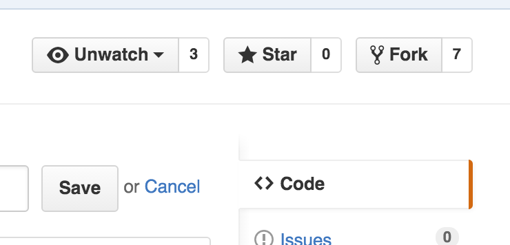
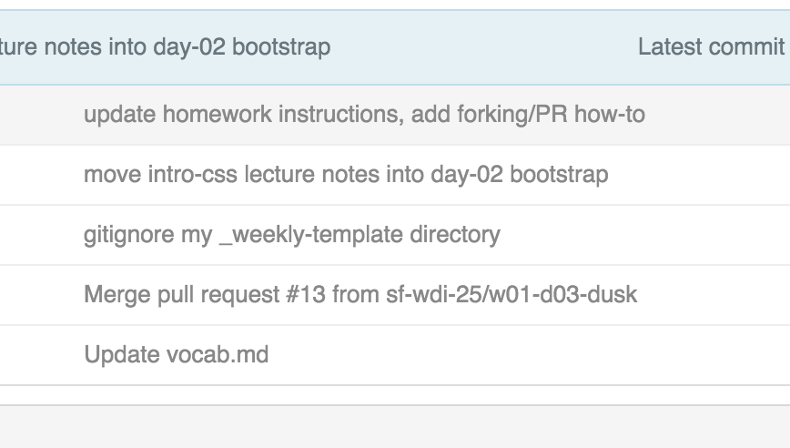
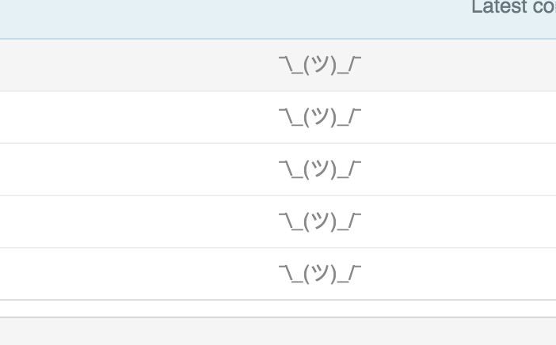
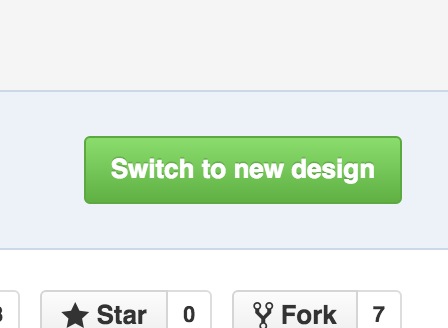
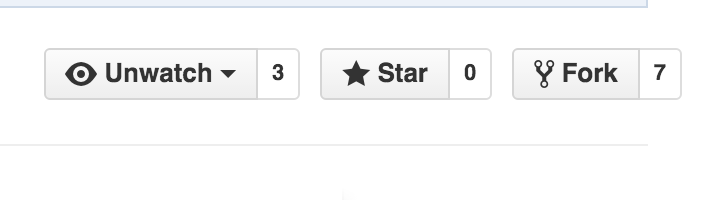
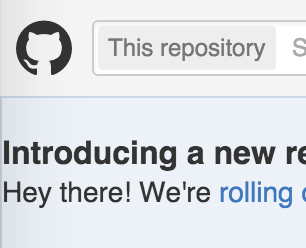

# Hack Github with jQuery!
The following challenges will require you to use your ninja jQuery skills to alter _this_ github repository page.

To begin, create a `my-solutions.md` file. For each challenge, copy over your jQuery solutions and reference the number/name of the challenge.

We highly suggest that you complete all of the challenges using the following jQuery methods:

 - `.text()`
 - `.html()`
 - `.append()`
 - `.addClass()`
 - `.removeClass()`
 - `.hide()`
 - `.show()`
 - `.toggleClass()`

## Challenge 1 - Name Changer
Change the name of the repository author (in this current case, nathanallen to `anonymous`

#### Before  

 

#### After

---

   
## Challenge 2 - Add some class
Add the `btn-primary` class to all of the buttons on the screen.  This should make them all green.

#### Before

 

#### After

---

   
## Challenge 3 - It's Shruggy!
Change all of the commit messages to shruggy ¯\\_(ツ)_/¯

#### Before

 

#### After

---

   
## Challenge 4 - I'm the captain now.
Remove the user links on the top right of the screen.

#### Before

 

#### After

---

   
## Challenge 5 - One big family
Change the values of the Watch, Star, and Fork social count all to ∞ (infinity).

#### Before

 

#### After

---

   
## Challenge 6 - JustinHub!
Change the Octocat logo/link at the top right of the page to a picture of Justin.  Use the linked image here:
 `https://avatars2.githubusercontent.com/u/4304660?v=3&s=40`

*Stretch: If you want to get real fancy, try to change the octocat to YOUR github profile photo!*  

#### Before

 

#### After

---

   
## Challenge 7 - Nuclear Option
Add a completely useless button that says `Delete Repository` to the right of the Fork button.

*Stretch: Add your own glyphicon to your custom-made button!*

#### Before

 

#### After

---

   
## Challenge 8 - Ugh, script kiddies
Add a folder to the notes file system display named "H4X0R3d!"

#### Before

 

#### After

