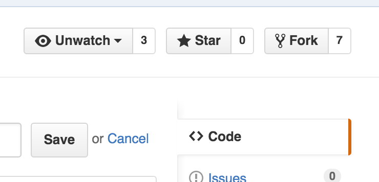
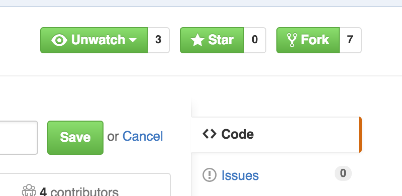

## Challenge 2 - Add some class
Add the `btn-primary` class to all of the buttons on the screen.  This should make them all green.

#### Before

 

#### After

#### [Go to next challenge](challenge-3.md)
